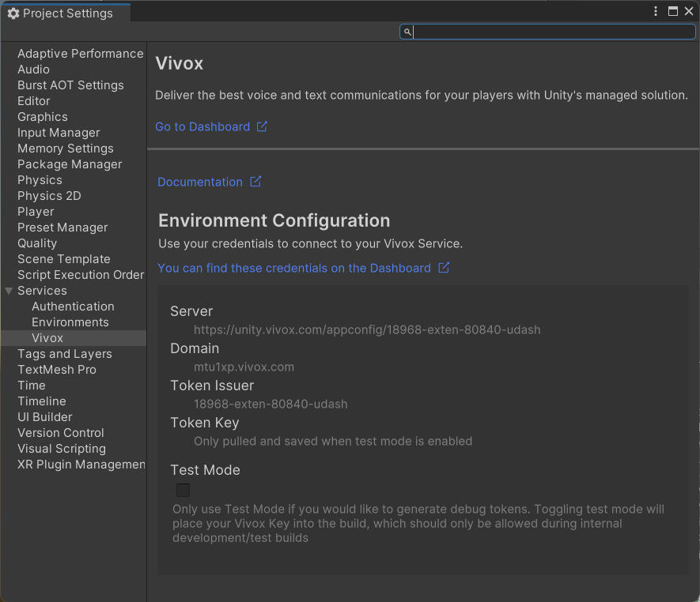
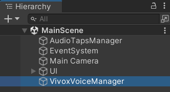
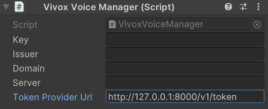
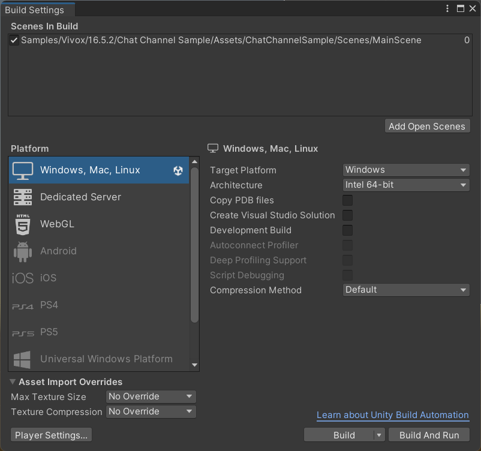
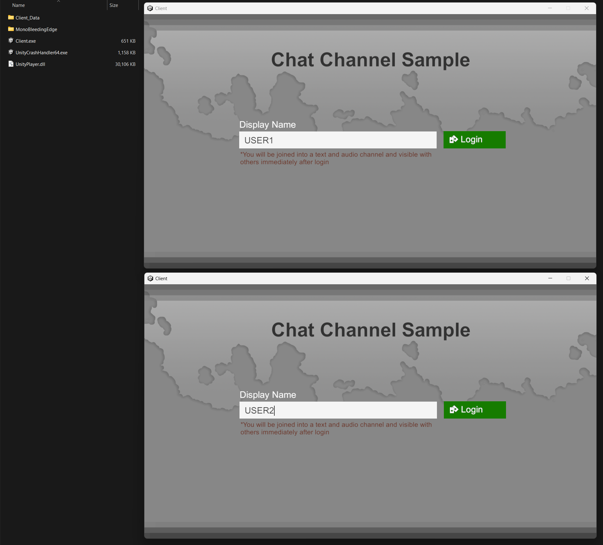
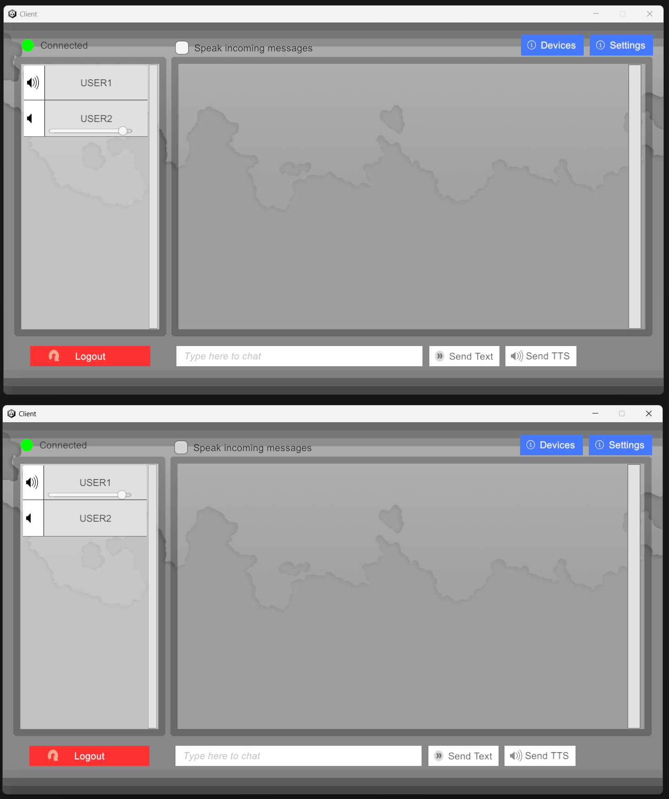

# Extend RTU Vivox Sample Game Unity

## Prerequisites

* Unity 2022.x

## How to Use

0. (Optional) There's an example [Vivox Authentication Server](Server) included in this repository. You can run it using `make run`. (do not forget to create a `.env` file)

1. Link your Unity project to an existing Unity Dashboard project. This will automatically pull in Vivox credentials into the Unity project. ([source](https://docs.unity.com/ugs/en-us/manual/vivox-unity/manual/Unity/developer-guide/implement-vivox-unity/unity-package-manager-vivox))

    

2. Open the [MainScene.unity](Client/Assets/Samples/Vivox/16.5.2/Chat%20Channel%20Sample/Assets/ChatChannelSample/Scenes/MainScene.unity) file.

3. Find and select the `VivoxVoiceManager` object in the Hierarchy window.

    

4. Locate and modify the `Token Provider Url` field in the Inspector field.

    

5. Build the Unity project. (`File / Build Settings` and then `Build`)

    

6. Launch 1 or more instances of the build. (`Client.exe`)

    

7. Click `Login` on each of the client(s).

    
